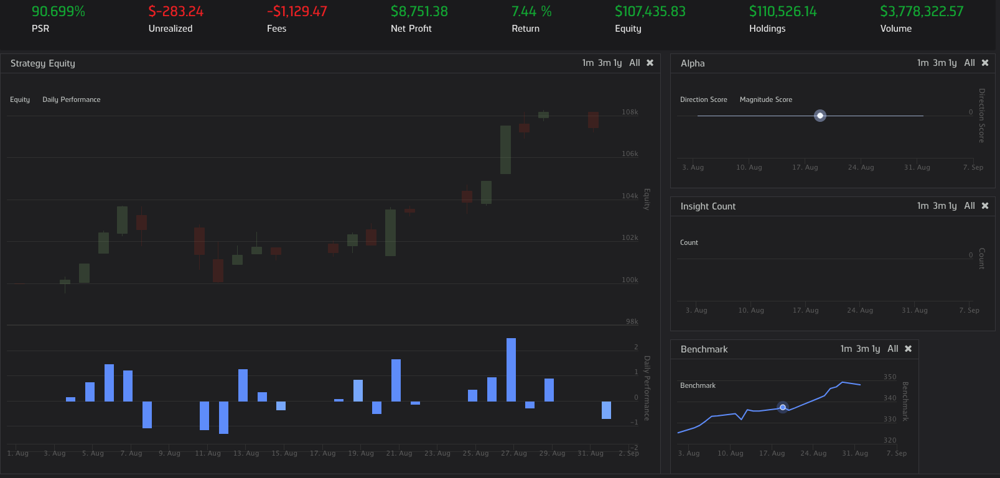
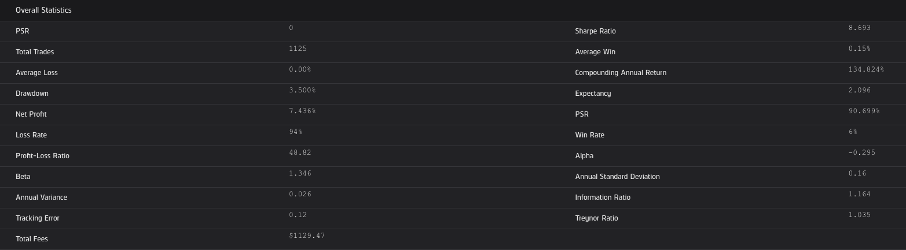

# MS_Winter_Intensive

Dates 1/6-1/12 2021

**Jerome Schmidt**

**Quantitative Investment Manager**

## Description
**A quantitative investment manager to actively manage a portfolio uses Equities. Built using Python, Keras, and Quantconnect.**

## Performance
**Month of August 2020**

## Phase 1
**Define Risk Model to trigger liquiation on portfolio losses.**

## Phase 2
**Create a Portfolio Management system to maximize profit while minimizing risk.**

## Phase 3
**Implement a functioning alpha model that will generate a signals for securities changes(up or down)**

**To reduce compute expenses and backtesting time, backtests were ran for a single month and benchmarked against "SPY"**

## Challenges I Faced
**The QuantConnect framework was challenging to learn when building a fulll model. For exmaple, the process to gathering historical data for training data was more cumbersome than simply importing a CSV**

**Student Name:**                
> Jerome Schmidt
